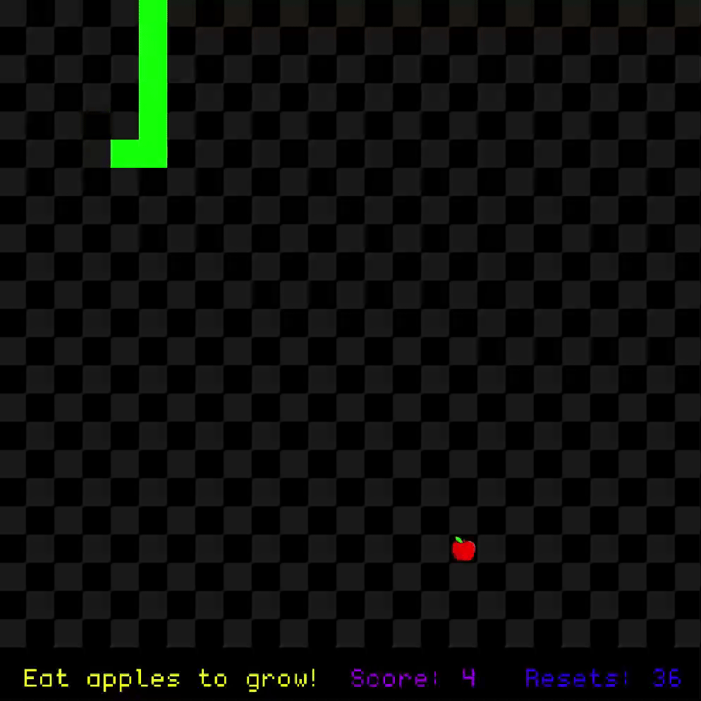
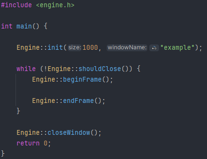
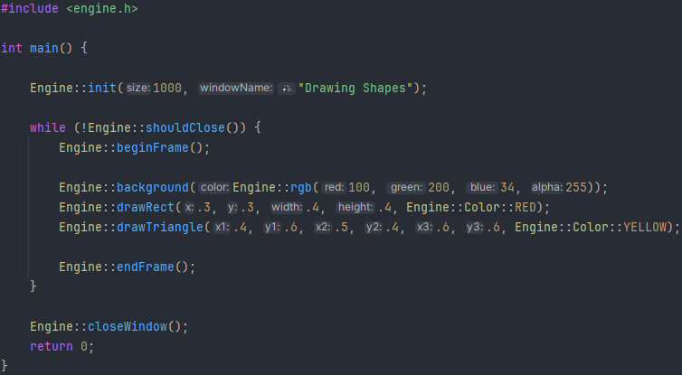
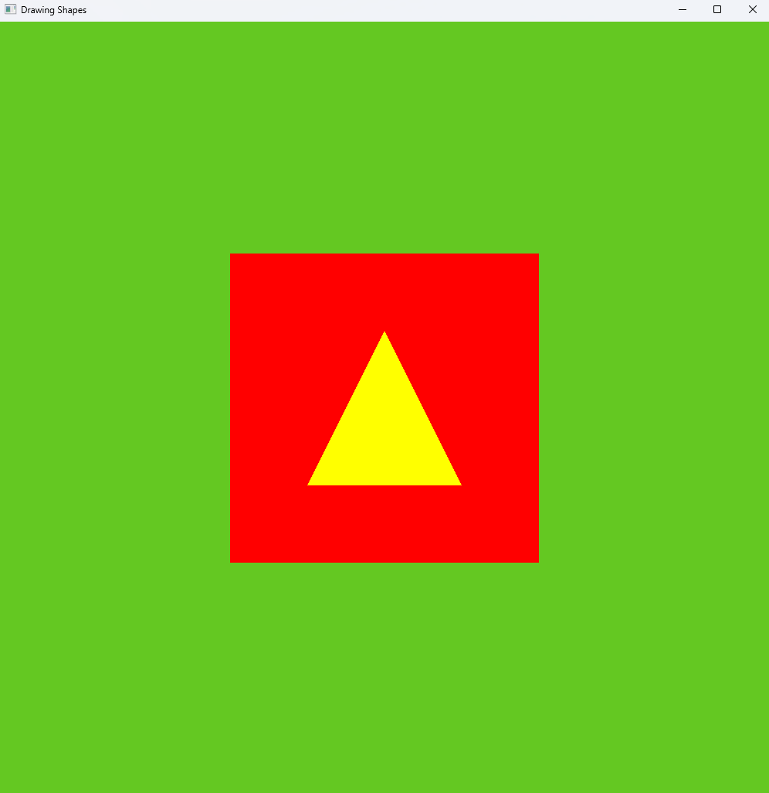
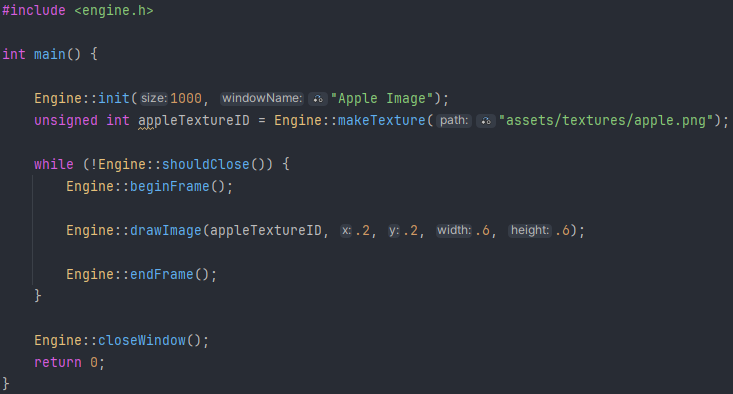
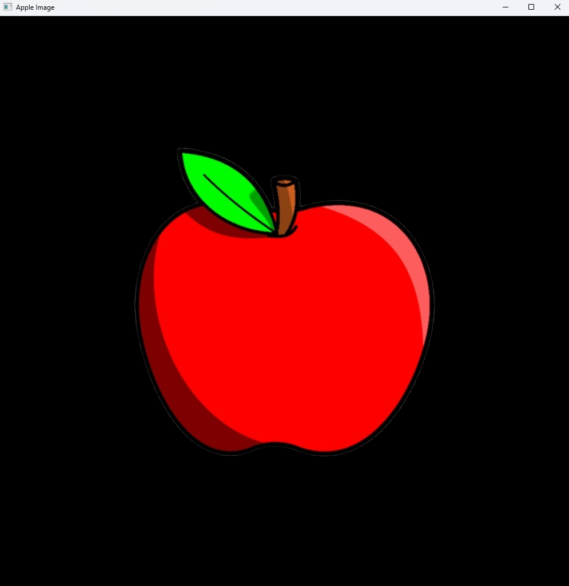
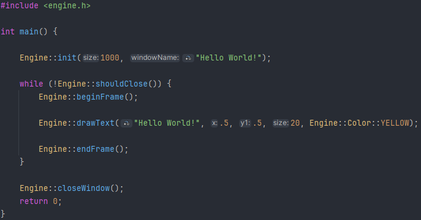
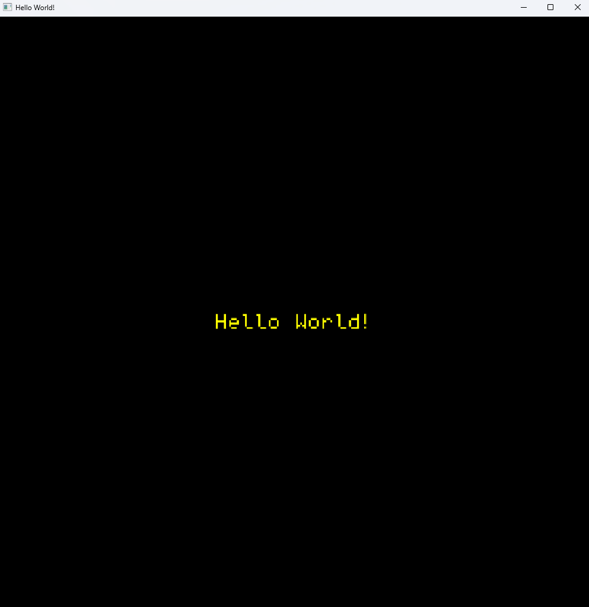
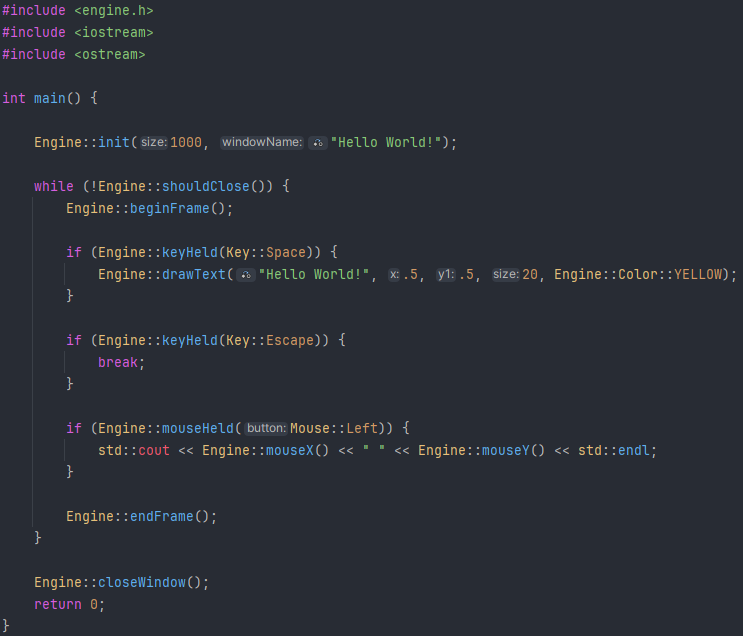

# Cellular Automata Graphics Engine (C++)

A lightweight C++ graphics engine built from scratch using OpenGL.  
Designed for learning, experimentation, and small projects such as simulations, cellular automata, and simple games.

---

## Features

- Modern OpenGL (3.3+ core profile)
- Batched 2D renderer
- Solid color and textured shapes
- Multiple textures per frame
- Simple window + input system
- 2 sample projects: Conway's Game of Life and Snake (Falling Sand WIP)
- Minimal abstractions for ease of use
- `include` contains the public API
- `src` contains internal implementations
- `sample_projects` contains standalone programs built with the engine

---

## Dependencies

- **C++20**
- **OpenGL**
- **GLFW** (window/context creation)
- **GLAD** (OpenGL loader)
- **stb_image** (image loading)

---

## Using the Engine

### Engine Skeleton Code

Create a `.cpp` file with a main function and make sure to `#include <engine.h>`.

The engine must be initialized before calling any other library functions. At the top of `main`, initialize the engine 
with `Engine::init(int screenSize, string windowName)`. This allows the user to set a desired screenSize in pixels
(square window) and what this window should be called.

Next, the main refresh loop must be set up. All per-frame calls must be wrapped in a `while (!Engine::shouldClose())` 
loop to ensure the screen only updates when it is supposed to. Before anything else is included in the loop, call 
`Engine::beginFrame()` so the engine can properly update input events and clear the screen. Once all draw calls and 
per-frame updates are done, end the loop with `Engine::endFrame()`.

To ensure proper shutdown, call `Engine::closeWindow()` after exiting the refresh loop.

Included below is the full skeleton code which should exist in every program that uses this engine.

Note that all variable initialization and any function that only needs to be called once should be written before the
main refresh loop to ensure program efficiency.

### Drawing Shapes, Text, and Textures

In the engine's current state, users can draw four things: triangles, rectangles, images, and text. All drawing relies 
on a coordinate system where the canvas ranges from **(0, 0)**, the top left corner, to **(1, 1)**, the bottom right 
corner. 

By calling `background(rgb_t color)`, users can set a custom-colored background. The struct `rgb_t` can be generated 
by using either `Engine::rgb(int red, int blue, int green, int alpha)` or by using the `Engine::Color` namespace, which
includes various predefined colors.

**Drawing Example:**

**Output window:**

Drawing images is slightly more complicated. The user must first create a texture to be used in their program. The 
desired image file should be added to `assets/textures`. To load the texture in a program, the user must first call
`Engine::makeTexture(string path)` during the initialization phase of the program (before the refresh loop). Then, the
image can be drawn just like a rectangle in the refresh loop, using the unsigned int texture ID returned from making 
the texture.

If desired, users can add an additional parameter to the `drawImage` call to tint the image a specific color, but there
is no tint by default.

**Image Example:**

**Output window:**

To draw text, the user can specify a string, location, size, and color using the `Engine::drawText` function. The 
default size is 20, but any positive size can be created (although either extreme is not aesthetically recommended).
Drawn text will be centered at the specified position.

**Text Example:**

**Output Window:**

### Taking User Input

The engine is able to detect whether a certain key or mouse button is pressed or released and the current position of 
the cursor. Functions provided include `keyHeld`, `mouseHeld`, `mouseX`, and `mouseY`. All valid keys and mouse buttons
are listed in `include/keyboard_mouse_inputs.h` within the `Key` and `Mouse` enum classes, respectively. 

**User Input Example:**

Note that upon pressing the Escape key, the program will break the refresh loop and close the window.

